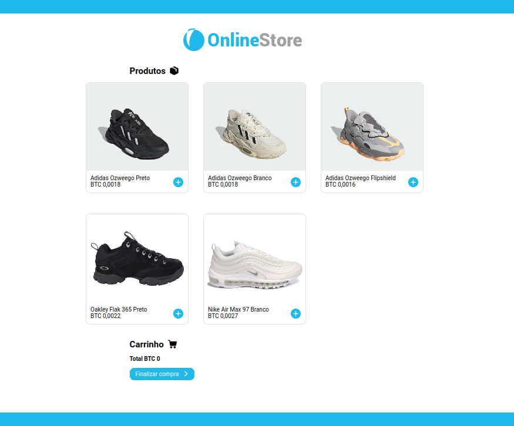

<h1 align="center">Online BTC Store</h1>

  

Projeto simples com JavaScript vanilla, que simula uma loja virtual com itens vendidos em Bitcoin. Inclui funcionalidades básicas como adicionar itens no carrinho, removê-los e feedback ao finalizar a compra.

